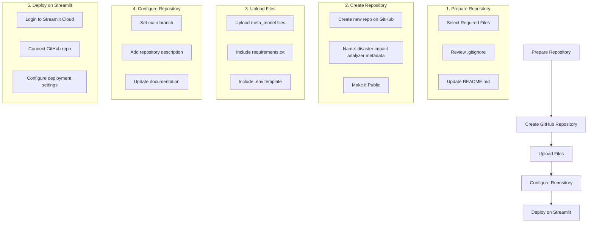

# Deployment Guide: Disaster Impact Analyzer (Metadata)

## Deployment Flow



## Detailed Steps

### 1. Prepare Repository

#### Required Files
The following files must be included in the repository:
- `app.py` - Main Streamlit application
- `model.py` - Core model logic
- `async_utils.py` - Async utilities
- `diagnostics.py` - API diagnostics
- `requirements.txt` - Dependencies
- `README.md` - Documentation
- `chhattisgarh_disaster_metadata_regenerated(new2).csv` - Backup dataset
- `.env.example` - Template for environment variables

#### Environment Variables
1. Create a `.env.example` file with the following template:
   ```
   GEMINI_API_KEY=your_api_key_here
   ```
2. Add `.env` to `.gitignore` to ensure sensitive data isn't committed

### 2. Create GitHub Repository

1. Go to [GitHub](https://github.com)
2. Click "New" to create a new repository
3. Set repository name: `disaster-impact-analyzer-metadata`
4. Add description: "A sophisticated tool for predicting and visualizing disaster impacts in Chhattisgarh using metadata analysis"
5. Make the repository Public
6. Do not initialize with README (we'll upload our own)

### 3. Upload Files to GitHub

1. Upload all required files mentioned above
2. Ensure proper organization:
   ```
   disaster-impact-analyzer-metadata/
   ├── app.py
   ├── model.py
   ├── async_utils.py
   ├── diagnostics.py
   ├── requirements.txt
   ├── README.md
   ├── chhattisgarh_disaster_metadata_regenerated(new2).csv
   └── .env.example
   ```

### 4. Configure Repository

1. Set main branch as default
2. Review repository settings
3. Ensure documentation is up to date

### 5. Deploy on Streamlit Cloud

1. Go to [Streamlit Community Cloud](https://streamlit.io/cloud)
2. Sign in with your GitHub account
3. Click "New app"
4. Select your repository and branch
5. Set the main file path as `app.py`
6. Configure deployment settings:
   - Set Python version (3.8+)
   - Add your secrets (GEMINI_API_KEY) in Streamlit's secret management
   - Configure any additional requirements

### Important Notes

1. **Environment Variables**: 
   - Never commit the actual `.env` file
   - Use Streamlit's secret management to set the GEMINI_API_KEY
   
2. **Dependencies**:
   - Ensure all dependencies are listed in `requirements.txt`
   - Use specific versions to avoid compatibility issues
   
3. **Data File**:
   - The CSV file will be included in the repository for offline functionality
   
4. **Security**:
   - Keep the API key secure
   - Use environment variables for sensitive information
   - Follow GitHub security best practices

## Troubleshooting

1. **Deployment Fails**:
   - Check Python version compatibility
   - Verify all dependencies are correctly listed
   - Ensure the main file path is correct
   
2. **API Issues**:
   - Verify API key is correctly set in Streamlit secrets
   - Check API access and quotas
   
3. **Resource Limitations**:
   - Monitor app resource usage
   - Optimize code if needed for better performance

## Next Steps

After deployment:
1. Test the application thoroughly
2. Monitor application performance
3. Set up GitHub Actions for automated deployment (optional)
4. Document any specific deployment configurations for future reference